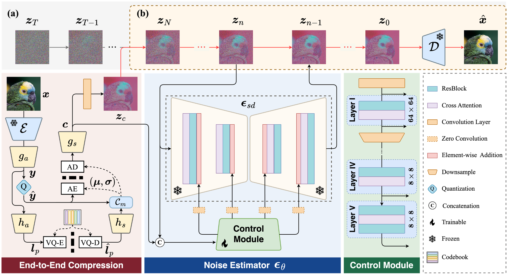
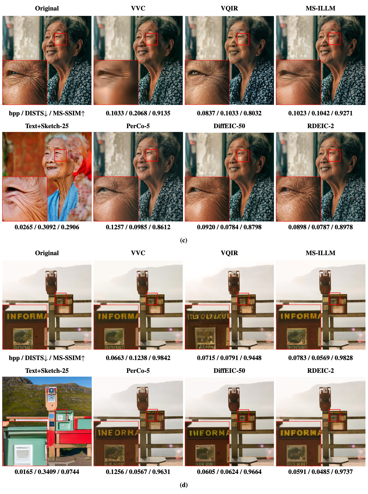
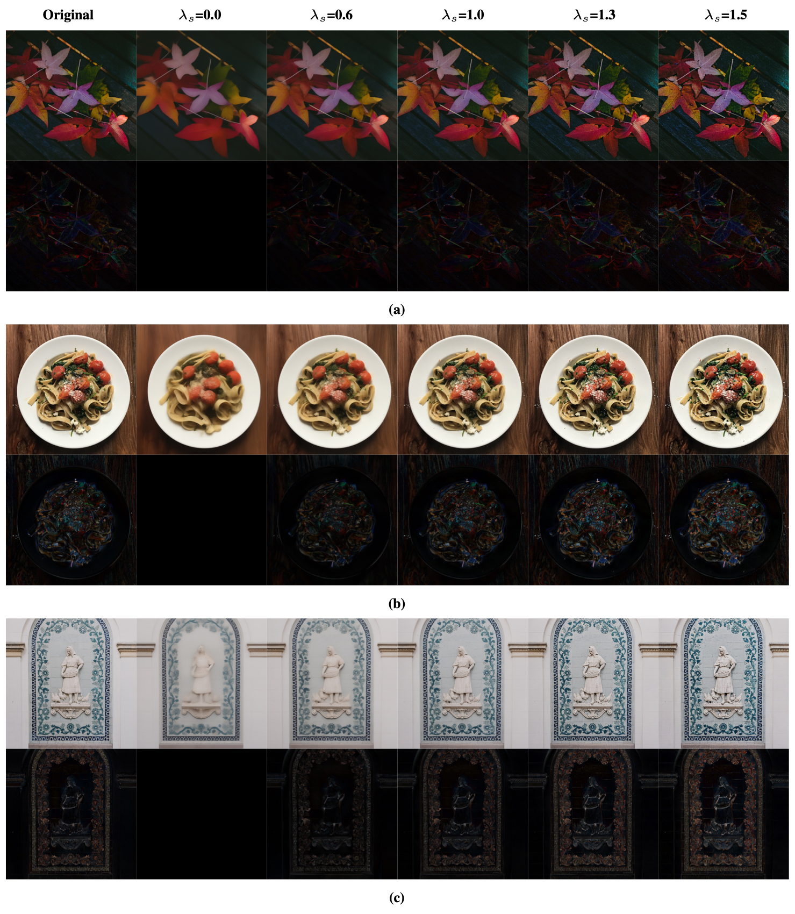
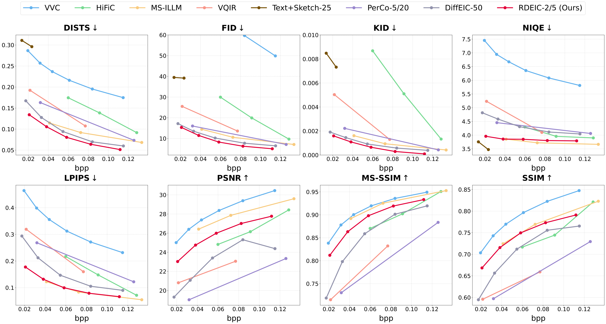
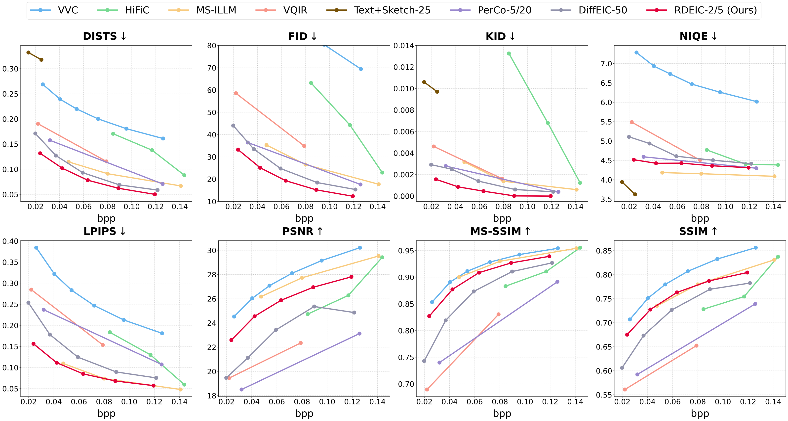
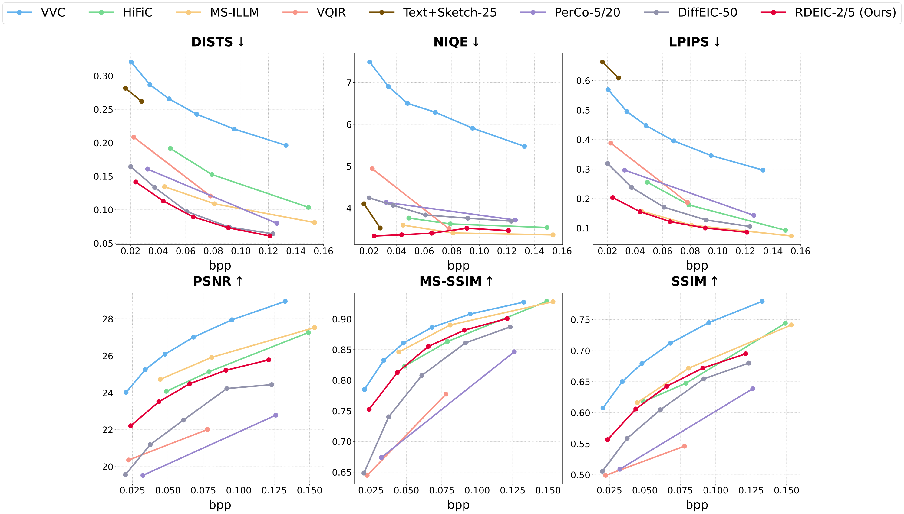

# Diffusion-based Extreme Image Compression with Compressed Feature Initialization

> [Zhiyuan Li](https://github.com/huai-chang), Yanhui Zhou, [Hao Wei](https://github.com/cshw2021), Chenyang Ge, [Ajmal Mian](https://research-repository.uwa.edu.au/en/persons/ajmal-mian) 
 

     

## :eyes: Visual Results

 
 Visual comparisons on the CLIC2020 dataset 

     
     

 
 Balance between smoothness and sharpness 

     
     

## :crossed_swords: Quantitative Performance

 
 CLIC2020 dataset 

     

 
 Tecnick dataset 

     

 

 
 Kodak dataset 

     

 

## :memo: TODO
- [ ] Release code
- [ ] Release pretrained models

## :heart: Acknowledgement
This work is based on [DiffEIC](https://github.com/huai-chang/DiffEIC) and [RelayDiffusion](https://github.com/THUDM/RelayDiffusion), thanks to their invaluable contributions.