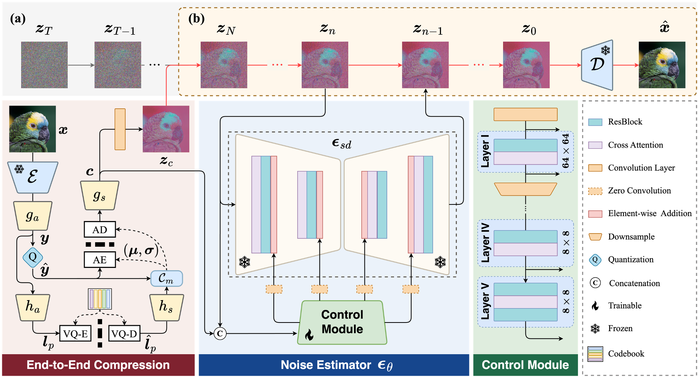
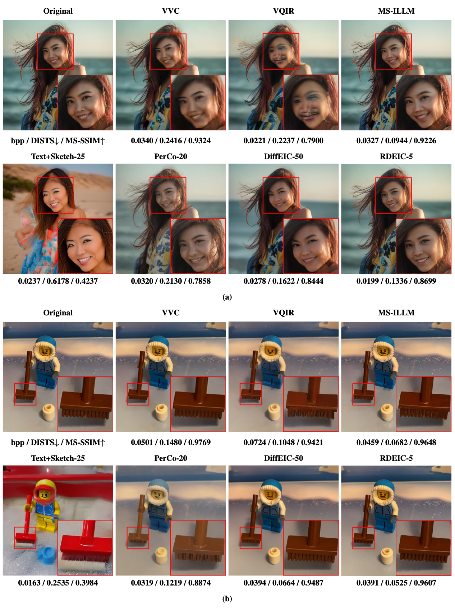
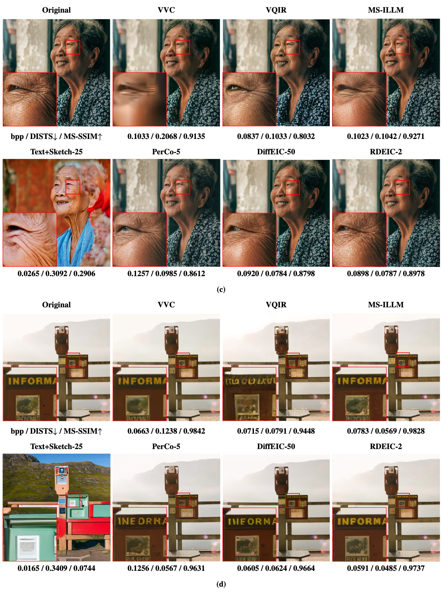
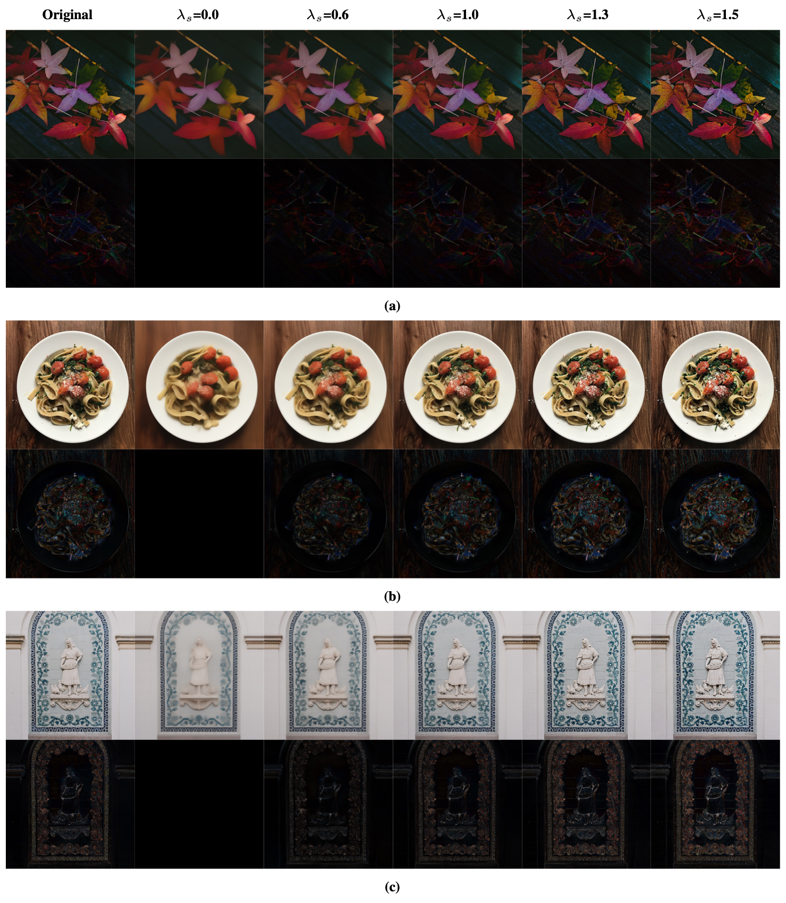
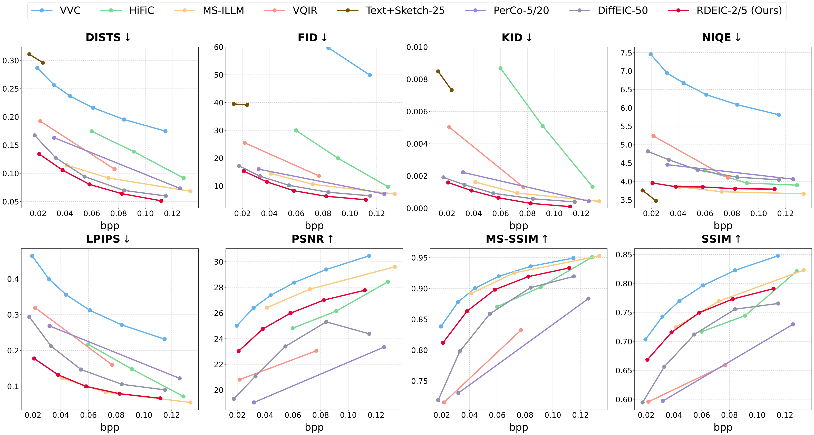
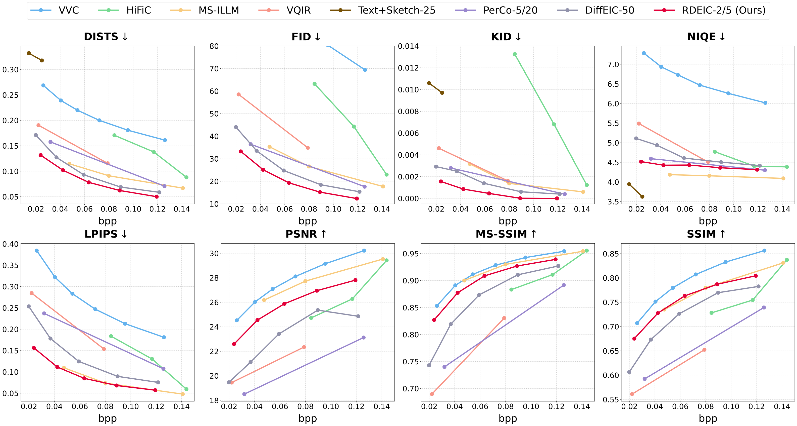
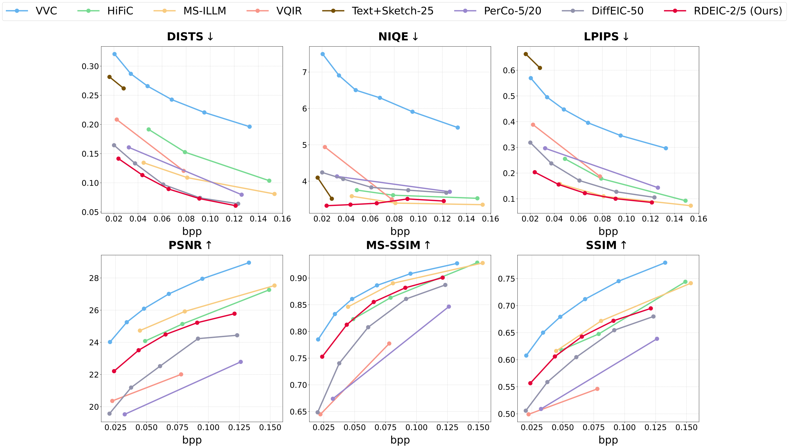

# RDEIC: Accelerating Diffusion-Based Extreme Image Compression with Relay Residual Diffusion

> [Zhiyuan Li](https://github.com/huai-chang), Yanhui Zhou, [Hao Wei](https://github.com/cshw2021), Chenyang Ge, [Ajmal Mian](https://research-repository.uwa.edu.au/en/persons/ajmal-mian)<br>
> :partying_face: This work is accepted by IEEE Transactions on Circuits and Systems for Video Technology.
 
:star: The quantitative metrics for each method presented in our paper can be found in [result.xlsx](/indicators/results.xlsx).

<p align="center">
    <br>
</p>


## <a name="visual_results"></a>:eyes: Visual Results
<details> <summary> Visual comparisons on the CLIC2020 dataset </summary>
<p align="center">
    <br>
    <br>
</p>
</details>

<details> <summary> Balance between smoothness and sharpness </summary>
<p align="center">
    <br>
    <br>
</p>
</details>

## <a name="quantitative_performance"></a>:crossed_swords: Quantitative Performance
<details> <summary> CLIC2020 dataset </summary>
<p align="center">
    <br>
</p>
</details>

<details> <summary> Tecnick dataset </summary>
<p align="center">
    <br>
</p>
</details> 

<details> <summary> Kodak dataset </summary>
<p align="center">
    <br>
</p>
</details> 

## :wrench: Installation

```bash
# clone this repo
git clone https://github.com/huai-chang/RDEIC.git
cd RDEIC

# create an environment
conda create -n rdeic python=3.8
conda activate rdeic
pip install torch==2.0.1
pip install tb-nightly --index-url https://pypi.org/simple
pip install -r requirements.txt
```

## <a name="train"></a>:computer: Train

### Preparation
1. Download LSDIR dataset from [Baidu Netdisk](https://pan.baidu.com/s/1IvowtZSRAPn_CnhhASEqgw?pwd=nck8) or [Google Drive](https://drive.google.com/drive/folders/1x2Ny2z3q8sIKhJb_evoglFeFj8Le_1Tt?usp=drive_link).
   
2. Generate file list of training set and validation set.

   ```
   python3 make_fire_list.py\
   --train_folder [path_to_train_folder]\
   --test_folder [path_to_test_folder]\
   --save_folder [path_to_save_floder]
   ```
   After running this script, you will get two file lists in save_folder, each line in a file list contains an absolute path of an image file:

   ```
   save_folder
   ├── train.list # training file list
   └── valid.list # validation file list
   ```

3. Download pretrained [Stable Diffusion v2.1](https://huggingface.co/stabilityai/stable-diffusion-2-1-base) into `./weight`.
   ```
   wget https://huggingface.co/stabilityai/stable-diffusion-2-1-base/resolve/main/v2-1_512-ema-pruned.ckpt --no-check-certificate
   ```

### Independent training
1. Modify the configuration file.
   ```
   # ./configs/train_rdeic.yaml
   resume: ~ or path to the initial checkpoint
   default_root_dir: path to save logs and checkpoints

   # ./configs/model/rdeic.yaml
   is_refine: False
   learning_rate: 1e-4 or 2e-5
   l_guide_weight: 2 #{2,1,0.5,0.25,0.1}
   ```

2. Start training.
   ```
   python3 train.py
   ```

### Fixed-step fine-tuning
1. Modify the configuration file. 
   ```
   # ./configs/train_rdeic.yaml
   resume: path to the initial checkpoint
   default_root_dir: path to save logs and checkpoints.

   # ./configs/model/rdeic.yaml
   is_refine: True
   fixed_step: 2 or 5
   learning_rate: 2e-5
   l_guide_weight: 2 #{2,1,0.5,0.25,0.1}

   # ./configs/dataset/lic_train.yaml
   out_size: 256
   ```

2. Start training.
   ```
   python3 train.py
   ```

## <a name="inference"></a>:zap: Inference
1. Download pretrained [Stable Diffusion v2.1](https://huggingface.co/stabilityai/stable-diffusion-2-1-base) into `./weight`.
   ```
   wget https://huggingface.co/stabilityai/stable-diffusion-2-1-base/resolve/main/v2-1_512-ema-pruned.ckpt --no-check-certificate
   ```

2. Download the pre-trained weights for the [Compression and Control Module](https://drive.google.com/drive/folders/1etNq6TqGQYaxih2RFL_ILenRWYcyxyDf?usp=share_link) into `./weight`.

3. Download [test datasets](https://drive.google.com/drive/folders/1_EOEzocurEwETqiCjZjOrN_Lui3HaNnn?usp=share_link).

4. Run the following command.

   ```
   python3 inference_partition.py \
   --ckpt_sd ./weight/v2-1_512-ema-pruned.ckpt \
   --ckpt_lc ./weight/rdeic_2_step2.ckpt \
   --config configs/model/rdeic.yaml \
   --input path to input images \
   --output path to output files \
   --steps 2 \
   --guidance_scale 1.0 \
   --device cuda 
   ```


## <a name="todo"></a>:memo: TODO
- [x] Release code
- [x] Release pretrained models

## <a name="acknowledgement"></a>:heart: Acknowledgement
This work is based on [DiffEIC](https://github.com/huai-chang/DiffEIC) and [CVQ-VAE](https://github.com/lyndonzheng/cvq-vae), thanks to their invaluable contributions.

## <a name="cite"></a>:clipboard: Citation

Please cite us if our work is useful for your research.
```
@article{li2025rdeic,
  title={RDEIC: Accelerating Diffusion-Based Extreme Image Compression with Relay Residual Diffusion},
  author={Li, Zhiyuan and Zhou, Yanhui and Wei, Hao and Ge, Chenyang and Mian, Ajmal},
  journal={IEEE Transactions on Circuits and Systems for Video Technology},
  year={2025},
  publisher={IEEE}
}
```
